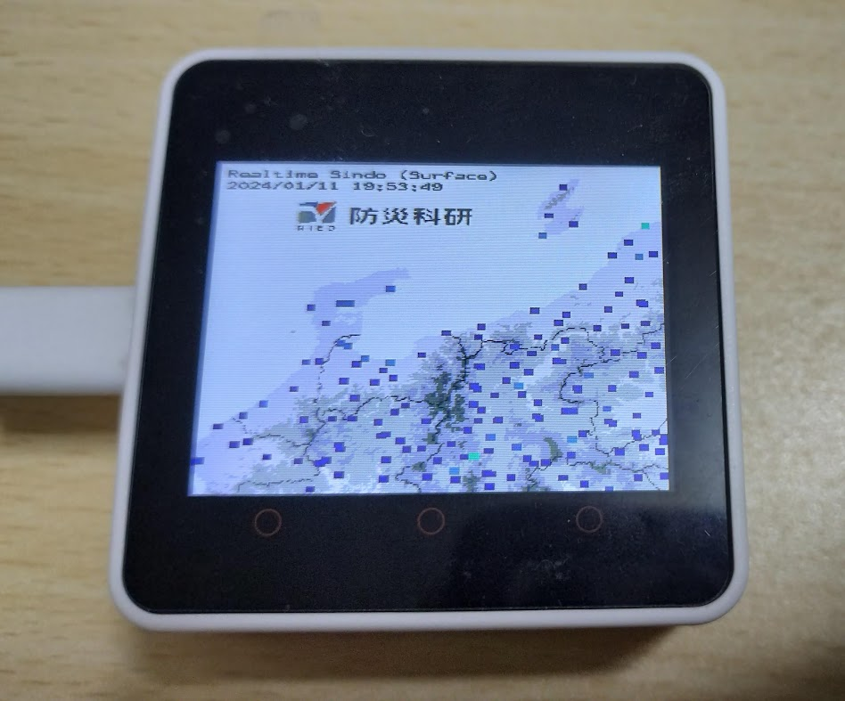

# Kyoshin_Noto_by_M5Core2

M5Stack core2で動作する、能登地方の強震モニタです。  
以下の記事のプログラムを改変して作成しました。  
http://www.ria-lab.com/archives/3339

また、防災科研（NIED）の強震モニタのデータを利用しています。  
http://www.kmoni.bosai.go.jp

## 使用時の注意
使用前には`main.cpp`に接続先のWiFi情報を記載する必要があります。  
その後、VSCode + PlatformIOでコンパイル&アップロードしてください。

## ライセンス
移植元では[NYSLライセンス](https://www.kmonos.net/nysl/)でしたが、知名度や利便性を考えMITライセンスで公開します。
